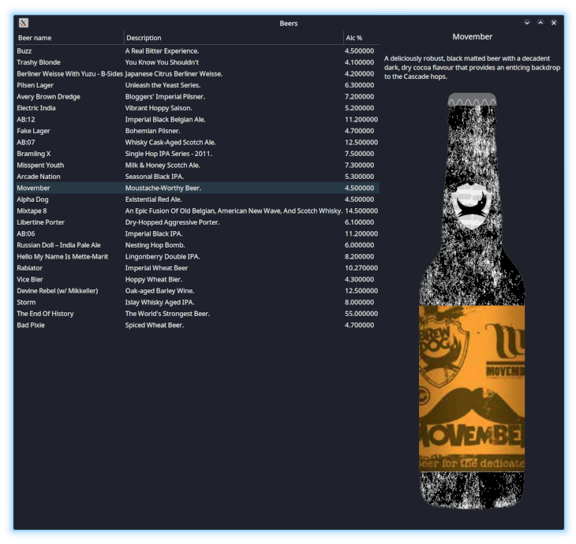

# Hello worlds in Python and GTK

## Hello world vertical
Simple vertical box layout

## Hello world static list
List from static data

## Hello world beers
Retrieve beers list from the public and open source [punk beer rest apis](https://punkapi.com/)

## Hello world beers detail
Added detail view updated on list item click

Here the result:

